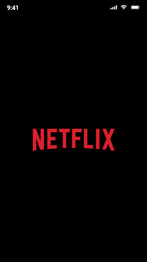
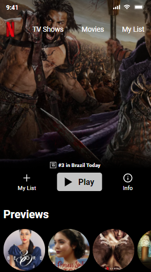
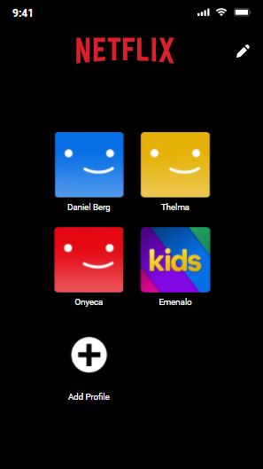
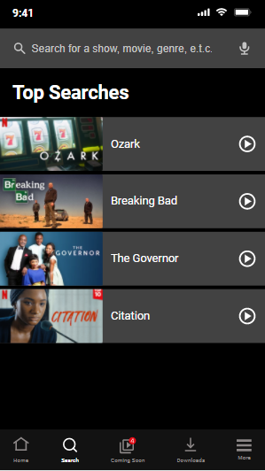
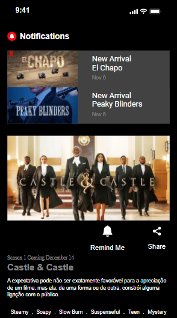
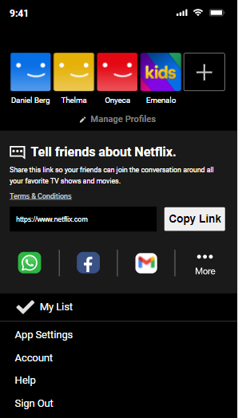

 

# Clonando a Netflix

[](https://github.com/Gilvan751/maratonas-clonando-a-netflix/blob/main/LICENSE) 


# Sobre o projeto

https://gilvanguru.com.br

Clonando a Netflix foi um desafio Front-end  mobile construída durante a 1ª edição da **Maratonas Academy** - **Clonando a Netflix com HTML, CSS e GitHub**, evento organizado por   [Maratonas academy](https://hub.maratonas.academy).

- Este foi um desafio muito importante nessa minha caminhada, onde clonei as páginas da  Netflix com os conhecimentos de HTML e CSS  do zero.
- Utilizamos o Git  uma ferramenta tão útil e prática para o sistema de controle de alterações. 
 - Utilizamos o GitHub para guardar e  compartilhar o projeto na comunidade de desenvolvedores.
 - Utilizamos a padronização do BEM, sendo ele muito importante por sua facilidade e simplicidade no uso que traz inúmeras vantagens aos projetos front-end que a adotam.
- Utilizamos o HTML semântico para descrever o significado do conteúdo presente em documentos HTML, tornando-o mais claro tanto para programadores quanto para browsers e outras engines que processam essa informação.

## Resumo do Desafio em uma única palavra:
  # *Norteamento* :
   Com esse desafio foi possível aprender a desenvolver uma página web do zero, bem como encontrar uma metodologia a ser seguida do inicio ao final do desafio.
   <br><br>

## Layout mobile <br><br>

   <br>
   <br>
   <br>

# Tecnologias utilizadas

## Front end
- HTML
- CSS
- Git
- GitHub
- Vercel (Deploy)


# Como executar o projeto no pc


## Front end web

```bash
# abra o projeto 
 No navegador digite
 https://gilvanguru.com.br

# vai abrir uma tela preta com informações:
    Opa, sua resolução está muito grande!
Parece que você está usando um NOTEBOOK, tente acessar no celular
# click com o mouse na tela lado direito, vai em inspecionar
minimize a tela de Elements e navegue na página, normalmente.


```

# Autor

Gilvan Oliveira Silva

https://www.gilvanguru.com.br

## Referências:
- Daniel Bergholz(team)
- Bruno Fraga(team)
- https://hub.maratonas.academy


 

 


